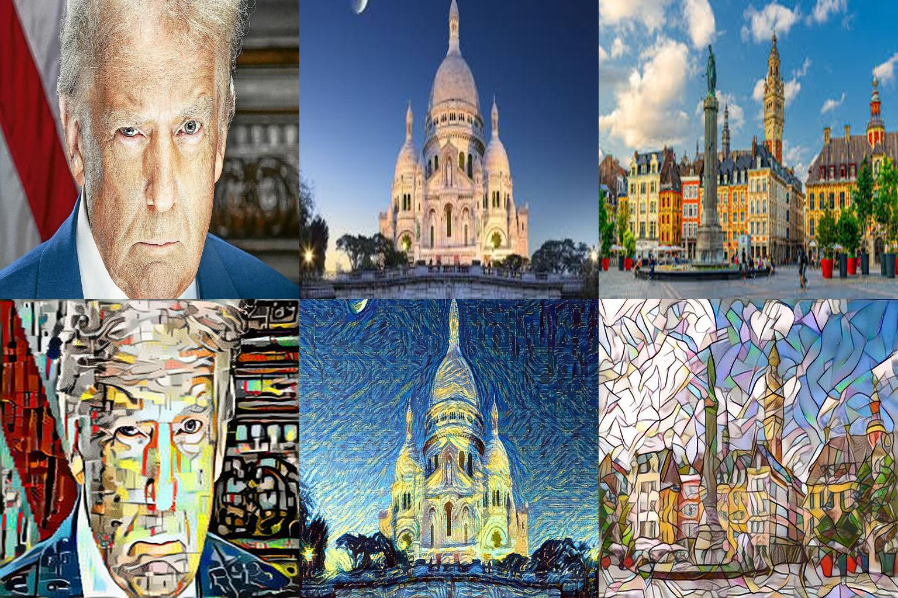
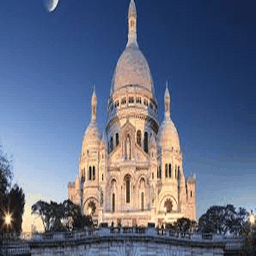

# Style Transfer with TensorFlow

This project implements **Style Transfer** based on the methods of:
- **Gatys et al.** for traditional style transfer.
- **Johnson et al.** for Fast Style Transfer using a transformer network.

## Results
Below is a showcase of the results:

### Example Transformations:


### Training Visualization:


---

## Instructions to Test the App
You can test the Fast Style Transfer model on your own images using the provided Streamlit app and FastAPI server.

### Step 1: Download the Pre-trained Model
Download the pre-trained `fast_transformer_net` model from [this Google Drive link](https://drive.google.com/drive/folders/1hCjiEI5vMO8RnpuBMl5Ohy9-QYruIQla?usp=drive_link) and place it in the `models/transformer_net/` directory.

### Step 2: Run the FastAPI Server
The FastAPI server serves the model for inference.
```bash
uvicorn api.main_api:app --host 0.0.0.0 --port 8000
```

### Step 3: Run the Streamlit App
The Streamlit app allows you to test the style transfer on local images.
```bash
streamlit run app/Style_Transfer_Demo.py
```

### Step 4: Open the App
Navigate to [http://localhost:8501](http://localhost:8501) in your browser to test the app.

---

## Instructions to Train a Model from Scratch
If you'd like to train your own Fast Style Transfer model, follow these steps:

### Step 1: Prepare Your Dataset
- Ensure you have a dataset of content images (e.g., COCO dataset).

### Step 2: Run the Training Script
Use the `train.py` script to train a new transformer network.
```bash
python src/train.py \
    --dataset_path /path/to/content/images \
    --style_image_path /path/to/style/image.jpg \
    --batch_size 4 \
    --epochs 2 \
    --image_size 256 \
    --carefulness 5 \
    --hyperparameters_path /path/to/hyperparameters.json \
    --style starry_night \
    --dataset_ratio 1.0
```
### Step 3: Run the Training Script
Use the `train.py` script to train a new transformer network. Below are the arguments you can provide:
```bash
python train.py \
    --dataset_path /path/to/content/images \
    --style_image_path /path/to/style/image.jpg \
    --batch_size 4 \
    --epochs 2 \
    --image_size 256 \
    --carefulness 5 \
    --hyperparameters_path /path/to/hyperparameters.json \
    --style starry_night \
    --dataset_ratio 1.0
```

### Step 4: Monitor Training
The script will save intermediate results and the final trained model in the `models/` directory.


---

## Requirements
To install the required Python libraries, run:
```bash
pip install -r requirements.txt
```

---

## References
- [A Neural Algorithm of Artistic Style](https://arxiv.org/abs/1508.06576) by Gatys et al.
- [Perceptual Losses for Real-Time Style Transfer and Super-Resolution](https://arxiv.org/abs/1603.08155) by Johnson et al.

---

Enjoy experimenting with style transfer and creating stunning artistic transformations!